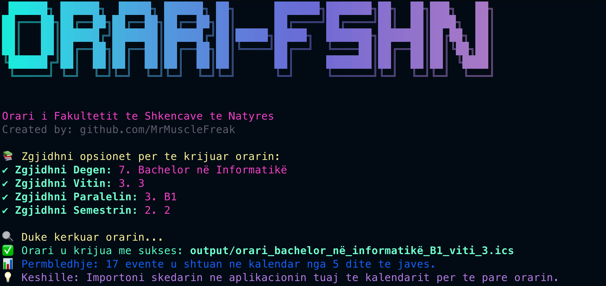

# Orari FSHN - Gjenerator i Kalendareve



## Permbledhje

Orari FSHN eshte nje aplikacion ne "command-line" qe gjeneron skedare kalendari (formati ICS) per studentet e Fakultetit te Shkencave te Natyres (FSHN). Ky program merr te dhena te orarit nga serveri i FSHN, perpunon HTML-ne dhe krijon skedare ICS qe mund te importohen ne aplikacione si Google Calendar, Apple Calendar, Outlook, etj.

## Karakteristikat Kryesore

- **Gjenerim i ICS:** Krijon skedare te kalendarit rreth orarit duke nisur nga data e krijimit deri ne fund te semestrit.
- **Informacione te Detajuara:** Per secilen ore shfaqet emri i lendes, profesori, email-i dhe klasa.
- **Strukture Modulare:** Projekt i ndare ne module per API, perpunim, gjenerator dhe funksione ndihmese.
- **Interaktivitet:** Perdor nje nderfaqe "command-line" me mesazhe me ngjyra per nje eksperience me vizuale dhe te kendshme.

## Instalimi

Si fillim duhet te keni [Node](https://nodejs.org/en) edhe [git](https://git-scm.com/) te instaluar.

1. Clone the repository:

   ```bash
   git clone https://github.com/MrMuscleFreak/orari-FSHN.git
   cd orariFSHN
   ```

2. Instaloni packages te nevojshme:

   ```bash
   npm install
   ```

## Perdorimi

1. Nisni aplikacionin:

   ```bash
   node src/index.js
   ```

2. Ndiqni udhezimet ne terminal per te zgjedhur parametrat e nevojshme (dega, vit, paralel, semestri).

3. Skedari ICS i gjeneruar do te gjendet ne folderin `/output`.

4. Importoni skedarin ICS ne aplikacionin tuaj te kalendarit (Google Calendar, Apple Calendar, Outlook etj.).
   - ⚠️ Kujdes ⚠️ : N.q.s doni ta importoni ne calendar ne iPhone, duhet te shkarkoni shortuct [ICS to Calendar](https://routinehub.co/download/21768/) dhe me pas mbasi ta keni kaluar file ne telefonin tuaj nepermjet whatsapp/email etj, klikoni Share -> ICS To Calendar -> Add All


## Detaje Teknike

- **Marrja e te Dhenave:** Perdoret kerkese POST per te marre HTML-ne e orarit nga serveri i FSHN.
- **Perpunimi i HTML:** HTML perpunohet duke perdorur module qe ndajne dhe bashkojne informacionet per secilen dite te javes.
- **Gjenerimi i ICS:** Skedari ICS perfshin evente te cilat perseriten cdo jave deri ne fund te semestrit dhe permban informacione te detajuara per çdo ore (lende, profesori, email, klasen).
- **Ngjyra ne Konsole:** Aplikacioni perdor module si chalk, figlet dhe gradient-string per nje nderfaqe vizuale terheqese ne terminal.

## Kontributet

Kontributet jane te mireseardhura! Ju lutem, dergoni nje Pull Request ne GitHub.

## Licenca

Ky projekt eshte licencuar sipas Licences MIT.
